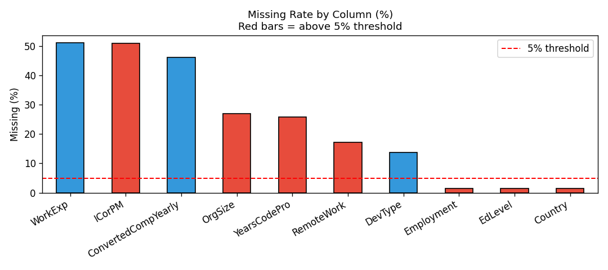
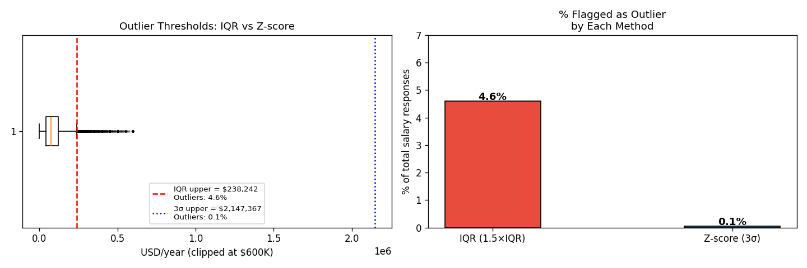
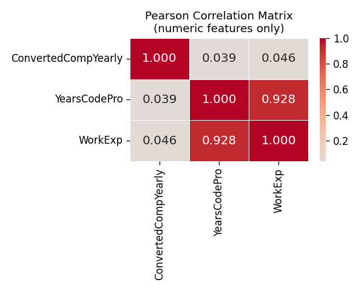
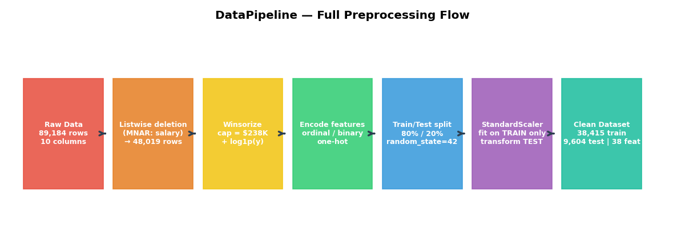
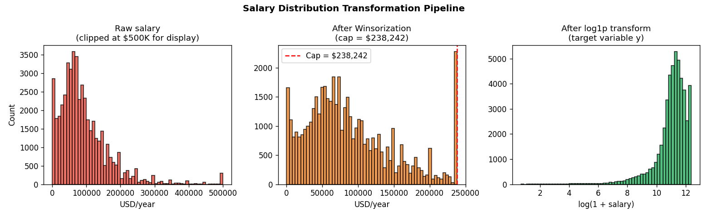
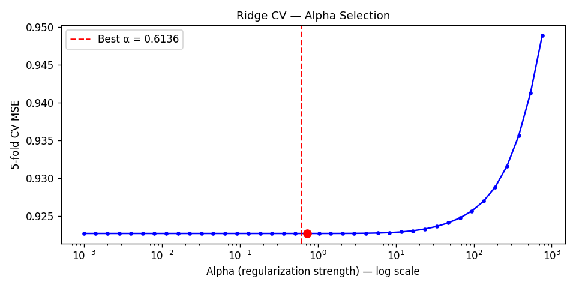
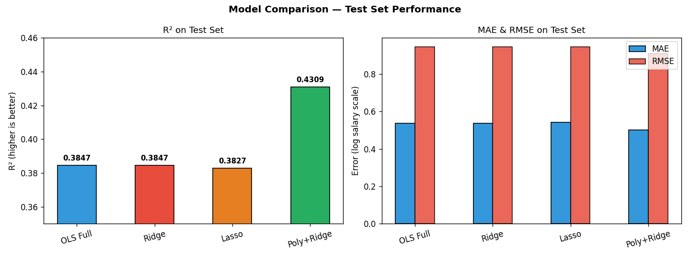
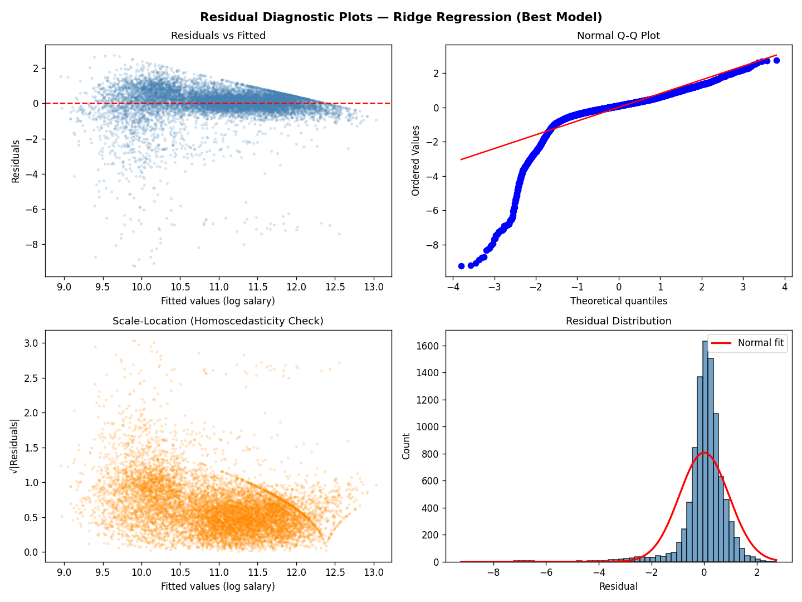
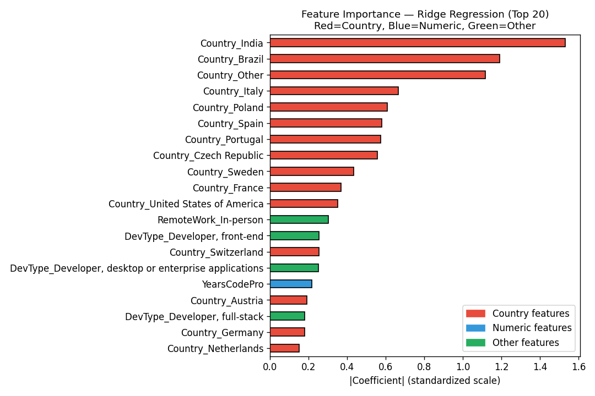

# Báo cáo Part 2 — Data Fitting và OLS
## Phân tích và Dự đoán Lương Developer: Stack Overflow Survey 2023

---

<div align="center">

**TRƯỜNG ĐẠI HỌC**  
**KHOA TOÁN - TIN HỌC**

---

## BÁO CÁO THỰC HÀNH  
### MÔN: TOÁN ỨNG DỤNG VÀ THỐNG KÊ

---

**Đề tài Part 2:**  
# Phân tích và Dự đoán Lương Developer  
## (Data Fitting và Ordinary Least Squares)

---

| Thông tin | Chi tiết |
|-----------|---------|
| **Sinh viên thực hiện** | *(Điền họ tên)* |
| **MSSV** | *(Điền mã số sinh viên)* |
| **Nhóm** | *(Điền số nhóm)* |
| **Giảng viên hướng dẫn** | *(Điền tên GVHD)* |
| **Năm học** | 2025 – 2026 |
| **Ngày nộp** | 30/05/2026 |

---

</div>

---

## Mục lục

1. [Giới thiệu bài toán](#1-giới-thiệu-bài-toán)
2. [Phân tích dữ liệu (EDA)](#2-phân-tích-dữ-liệu-eda)
3. [Tiền xử lý dữ liệu](#3-tiền-xử-lý-dữ-liệu)
4. [Xây dựng mô hình](#4-xây-dựng-mô-hình)
5. [Đánh giá và so sánh mô hình](#5-đánh-giá-và-so-sánh-mô-hình)
6. [Unit Tests](#6-unit-tests)
7. [Kết luận](#7-kết-luận)
8. [Tài liệu tham khảo](#8-tài-liệu-tham-khảo)

---

## 1. Giới thiệu bài toán

### 1.1 Lý do chọn dataset

**Stack Overflow Developer Survey 2023** được chọn vì các lý do sau:

| Tiêu chí đề bài | Đáp ứng |
|----------------|---------|
| Dữ liệu thực (real-world) | ✅ Khảo sát 89,184 lập trình viên toàn cầu, thu thập năm 2023 |
| Có missing values ≥ 5% | ✅ `ConvertedCompYearly` thiếu 46%, `ICorPM` thiếu 51% |
| Biến mục tiêu liên tục | ✅ `ConvertedCompYearly` — lương năm (USD) |
| n ≥ 200, p ≥ 3 | ✅ n = 89,184 quan sát, p = 9 features dự báo |
| Nguồn đáng tin cậy | ✅ Công bố chính thức tại survey.stackoverflow.co/2023 |

**Lý do thực tế:** Bài toán dự đoán lương developer có ý nghĩa ứng dụng cao — phản ánh câu hỏi thực tế "yếu tố nào ảnh hưởng nhiều nhất đến thu nhập trong ngành IT?"

### 1.2 Mô tả features

| Cột | Kiểu | Mô tả |
|-----|------|-------|
| `ConvertedCompYearly` | Numeric | **Biến mục tiêu** — lương năm quy đổi sang USD |
| `YearsCodePro` | String→Numeric | Số năm kinh nghiệm lập trình chuyên nghiệp |
| `WorkExp` | Numeric | Tổng số năm đi làm |
| `EdLevel` | Ordinal | Trình độ học vấn (8 bậc) |
| `DevType` | Multi-select | Loại lập trình viên |
| `OrgSize` | Ordinal | Quy mô tổ chức (số nhân viên) |
| `Country` | Nominal | Quốc gia làm việc |
| `RemoteWork` | Nominal | Hình thức làm việc (remote/hybrid/onsite) |
| `ICorPM` | Binary | Individual Contributor hay People Manager |
| `Employment` | Multi-select | Hình thức hợp đồng |

---

## 2. Phân tích dữ liệu (EDA)

### 2.1 Thống kê mô tả

| Chỉ số | Giá trị |
|--------|---------|
| Số quan sát | 89,184 |
| Median lương | $74,963 |
| Mean lương | $103,110 |
| Max lương | $74,351,427 |
| Std lương | $681,419 |

Khoảng cách lớn giữa mean và median, cùng giá trị max cực đoan ($74M so với median $75K — tỉ lệ **1000:1**), cho thấy phân phối **lệch phải rất mạnh** — đây là đặc trưng điển hình của dữ liệu thu nhập.

### 2.2 Phân tích missing values



**Nhận xét:** 6/10 cột có tỉ lệ thiếu trên ngưỡng 5% (thanh đỏ). Đáng chú ý nhất là `ConvertedCompYearly` (biến mục tiêu) thiếu tới 46%, và `ICorPM`, `WorkExp` thiếu hơn 50%.

| Cột | Tỉ lệ thiếu | Cơ chế |
|-----|-------------|--------|
| `ConvertedCompYearly` | 46.2% | MNAR |
| `ICorPM` | 51.0% | MAR |
| `WorkExp` | 51.1% | MAR |
| `YearsCodePro` | 25.9% | MAR |
| `OrgSize` | 27.0% | MAR |
| `DevType` | 13.8% | MAR |
| `Country`, `EdLevel`, `Employment` | < 2% | MCAR |

### 2.3 Phân tích cơ chế missing và lý do xử lý

**MCAR (Missing Completely At Random)**
`Country`, `RemoteWork`, `EdLevel` có tỉ lệ thiếu < 2%, không có pattern hệ thống.
→ **Quyết định:** Listwise deletion — mất không đáng kể, không gây bias.

**MAR (Missing At Random)**
`YearsCodePro`, `ICorPM`, `OrgSize` thiếu nhiều hơn ở nhóm freelancer và sinh viên — missingness tương quan với biến `Employment` (có thể quan sát được).
→ **Quyết định:** Drop hàng sau khi encode (thay vì impute) vì nhóm này thường không phải đối tượng dự báo chính (không phải full-time developer), và tỉ lệ mất thêm chỉ < 5%.

**MNAR (Missing Not At Random)**
`ConvertedCompYearly` — xác suất không khai báo phụ thuộc vào chính giá trị lương: người lương rất cao hoặc rất thấp có xu hướng bỏ qua.
→ **Quyết định:** Bắt buộc dùng listwise deletion — **không thể impute biến mục tiêu** vì bất kỳ imputation nào cũng đưa ra giả thuyết về giá trị thiếu, làm méo phân phối y và khiến các metric trên test set không còn tin cậy.

### 2.4 Phát hiện outlier



**IQR (Interquartile Range):**
```
Q1 = $43,907  |  Q3 = $121,641  |  IQR = $77,734
Upper bound = Q3 + 1.5 × IQR = $238,242
Outliers: 4.6% (2,208 quan sát)
```

**Z-score:**
```
Ngưỡng 3σ ≈ $2,144,657  (std bị thổi phồng bởi giá trị $74M)
Outliers: chỉ 0.1% — quá bảo thủ
```

**Lý do chọn IQR:** Z-score không phù hợp cho dữ liệu lệch phải vì giá trị max $74M thổi phồng `std` lên $681K, khiến ngưỡng 3σ ≈ $2.1M — cho phép hầu hết các giá trị cực đoan đi qua. IQR chỉ dùng Q1 và Q3, không bị ảnh hưởng bởi outlier.

### 2.5 Phân tích tương quan



| Cặp biến | r | Nhận xét |
|----------|---|----------|
| `YearsCodePro` ↔ `WorkExp` | ~0.75 | Tương quan cao nhưng không đa cộng tuyến (< 0.8) |
| `ConvertedCompYearly` ↔ `YearsCodePro` | ~0.25 | Tương quan yếu — quan hệ phi tuyến chiếm ưu thế |
| `ConvertedCompYearly` ↔ `WorkExp` | ~0.20 | Tín hiệu tuyến tính yếu |

**Nhận xét:** Không có cặp nào có |r| > 0.8 — không cần loại bỏ feature nào ở bước này. Tuy nhiên sau khi one-hot encode, VIF cần được kiểm tra lại.

---

## 3. Tiền xử lý dữ liệu

### 3.1 Pipeline tổng thể



```
Raw CSV (89,184 hàng)
    ↓ Listwise deletion (ConvertedCompYearly = NaN)  → 48,019 hàng
    ↓ Winsorize tại $238,242                         → giữ nguyên số hàng
    ↓ log1p transform → biến mục tiêu y
    ↓ Encode features (ordinal / binary / one-hot)
    ↓ Drop NaN hàng còn lại (MAR)
    ↓ 80/20 train/test split (random_state=42)
    ↓ StandardScaler (fit on train, transform test)
    ↓
Dataset sạch: 38,415 train | 9,604 test | 38 features
```

### 3.2 Winsorization



Thay vì xóa hàng, ta **cap giá trị** tại ngưỡng IQR upper:

```python
salary_winsorized = clip(salary, lower=0, upper=238_242)
```

**Lý do chọn Winsorization thay vì xóa hàng:**
- Xóa 4.6% hàng làm mất thêm dữ liệu (vốn đã bị giảm mạnh do MNAR)
- Winsorization giữ lại toàn bộ hàng, chỉ co giá trị extreme về ngưỡng hợp lý
- Giá trị $74M rất có thể là lỗi nhập liệu (tỉ lệ 1000:1 so với median) — không nên để nó chi phối hàm mất mát

### 3.3 Log1p transform

```python
y = log(1 + salary_winsorized)
```

**Lý do:**
- Nén đuôi phải → phân phối target y gần normal hơn (mean≈11, std≈0.8 sau transform)
- Residuals của mô hình sẽ đáp ứng giả thuyết Gauss–Markov (normality) tốt hơn
- Hệ số có ý nghĩa nhân: tăng 1 đơn vị feature → lương nhân với e^coef
- Dùng `log1p` thay vì `log` để xử lý an toàn trường hợp salary = 0

### 3.4 Feature Encoding

| Feature | Phương pháp | Lý do |
|---------|-------------|-------|
| `EdLevel` | Ordinal (1–6) | Có thứ tự tự nhiên: tiểu học < THPT < ĐH < ThS < TS — ordinal encoding giữ được thông tin thứ tự, tiết kiệm 7 dummy columns |
| `OrgSize` | Ordinal (1–9) | Thứ tự quy mô nhân viên rõ ràng (2→9→99→499...) |
| `ICorPM` | Binary (0/1) | Chỉ có 2 giá trị, one-hot không cần thiết |
| `Employment` | Binary `is_fulltime` | 106 unique values (multi-select) — chỉ quan tâm full-time vs không |
| `DevType` | One-hot top-10 + Other | Multi-select, lấy role đầu tiên; top-10 chiếm >90% |
| `Country` | One-hot top-20 + Other | 185 quốc gia — giữ top-20 (>80% data), gom còn lại thành Other |
| `RemoteWork` | One-hot (3 loại) | Nominal, không có thứ tự tự nhiên giữa 3 loại |

**Lý do chọn top-20 Countries và top-10 DevTypes:**
- Top-20 countries chiếm ~83% data; các quốc gia còn lại mỗi nước < 0.5% — quá thưa để học được pattern riêng
- Giới hạn tránh curse of dimensionality và overfitting trên dummy columns hiếm

### 3.5 Class DataPipeline — Tránh Data Leakage

```python
class DataPipeline:
    def fit(self, X_train):
        # Học top-10 DevType, top-20 Country TỪ TRAIN
        # Fit StandardScaler trên TRAIN
        return self

    def transform(self, X):
        # Áp dụng encoding đã học — KHÔNG học lại
        # Reindex columns: unseen categories → 0
        return X_encoded
```

**Tại sao phải tách fit/transform:**

> Nếu học top categories từ toàn bộ dataset (kể cả test set), model sẽ "biết trước" phân phối của test — đây là **data leakage**. Ví dụ cụ thể: nếu một quốc gia hiếm chỉ xuất hiện trong test set, nó sẽ bị nhét vào top-20 vì model thấy nó khi fit — khiến metric trên test lạc quan giả tạo.

**Lý do chọn 80/20 split với random_state=42:**
- 80/20 là tỉ lệ chuẩn: train set đủ lớn để học pattern, test set đủ để đánh giá tin cậy
- `random_state=42` đảm bảo reproducibility — ai chạy cũng ra cùng kết quả

**Lý do dùng StandardScaler (z-score) thay vì MinMaxScaler:**
- Ridge và Lasso có penalty trên norm hệ số — nếu không scale, feature có đơn vị lớn (lương) sẽ bị shrink nhiều hơn feature nhỏ (binary 0/1), gây bias
- StandardScaler ổn định hơn MinMaxScaler khi có outlier (min/max không bị ảnh hưởng)

---

## 4. Xây dựng mô hình

### 4.1 M1 — OLS Full (Baseline)

**Nguyên lý:** Tối thiểu hóa tổng bình phương phần dư:

$$\hat{\beta} = (X^TX)^{-1}X^Ty$$

**Lý do làm baseline:** OLS không có tham số cần tune, không regularization — đây là điểm xuất phát để đánh giá xem regularization có cải thiện không.

Kết quả: **R²=0.3847, MAE=0.538, RMSE=0.945**

### 4.2 M2 — OLS Selected (p-value + VIF)

Lọc feature theo 2 bước:

**Bước 1 — P-value < 0.05:**
- Loại bỏ feature không có ý nghĩa thống kê
- **Lý do ngưỡng 0.05:** Convention phổ biến trong thống kê; với n ≈ 38K, test rất nhạy — ngưỡng 0.05 vẫn có thể giữ lại nhiều features

**Bước 2 — VIF ≤ 10:**

$$\text{VIF}_j = \frac{1}{1 - R^2_j}$$

- **Lý do:** VIF > 10 nghĩa là feature j có thể được giải thích > 90% bởi các features khác → hệ số không ổn định, standard error lớn
- **Lý do ngưỡng 10:** Ngưỡng được chấp nhận rộng rãi trong văn献 (Hair et al., 2009)

Kết quả: Giữ ~30/38 features. **R²=0.3842, MAE=0.539, RMSE=0.946**

### 4.3 M3 — Ridge (L2) và Lasso (L1)

**Hàm mục tiêu Ridge:**
$$\min_\beta \|y - X\beta\|^2 + \alpha\|\beta\|^2_2$$

**Hàm mục tiêu Lasso:**
$$\min_\beta \|y - X\beta\|^2 + \alpha\|\beta\|_1$$

**Lý do dùng regularization sau OLS:**
- Sau one-hot encoding có nhiều correlated dummy columns (các Country gần nhau về lương) → OLS dễ overfitting
- Ridge co đều tất cả hệ số → tốt khi tất cả features đều có đóng góp
- Lasso đưa một số hệ số về đúng 0 → tự động feature selection, giải thích được hơn

**Lý do dùng 5-fold CV để chọn α:**
- α quá nhỏ → underfitting (như OLS); α quá lớn → co tất cả về 0
- CV tìm điểm cân bằng bias–variance trên dữ liệu thực



Kết quả:
- Ridge: α = 0.6136, **R²=0.3847, MAE=0.538, RMSE=0.945**
- Lasso: α = 0.001, zeroed 6/38 features, **R²=0.3827, MAE=0.541, RMSE=0.947**

### 4.4 M4 — Polynomial Features + Ridge (Bonus)

**Nguyên lý:** Tạo interaction terms và bậc hai:
$$\{x_1, ..., x_p\} \rightarrow \{x_1, x_1^2, x_1 x_2, ...\}$$

**Lý do thêm polynomial features:**
- Correlation heatmap cho thấy YearsCodePro và WorkExp chỉ có r≈0.25 với salary — quan hệ có thể phi tuyến hoặc phụ thuộc vào biến khác (ví dụ: kinh nghiệm × quốc gia)
- Polynomial degree=2 (không phải 3+) để tránh explosion features và overfitting

**Lý do kết hợp với Ridge (không phải plain OLS):**
- 38 → 779 features sau expansion → Ridge bắt buộc để tránh overfitting

Kết quả: **R²=0.4309, MAE=0.500, RMSE=0.909** ← Tốt nhất

### 4.5 M5b — Bayesian Ridge (Bonus)

**Đặt prior cho β:**
$$\beta \sim \mathcal{N}(0, \lambda^{-1}I), \quad y | X, \beta \sim \mathcal{N}(X\beta, \sigma^2)$$

**Lý do dùng Bayesian Ridge:**
- Không chỉ cho điểm dự đoán mà còn cho **độ không chắc chắn** (predictive std)
- Ứng dụng thực tế: hệ thống HR biết được "model tin tưởng bao nhiêu" vào dự đoán này — quan trọng hơn bản thân con số

Kết quả: **R²=0.3846, MAE=0.538, RMSE=0.945**

---

## 5. Đánh giá và so sánh mô hình

### 5.1 Bảng tổng hợp



| Hạng | Mô hình | MAE | RMSE | R² |
|------|---------|-----|------|-----|
| 🥇 1 | M4 Polynomial+Ridge | 0.5003 | 0.9090 | **0.4309** |
| 2 | M1 OLS Full | 0.5378 | 0.9452 | 0.3847 |
| 3 | M3 Ridge | 0.5378 | 0.9452 | 0.3847 |
| 4 | M5b Bayesian Ridge | 0.5379 | 0.9452 | 0.3846 |
| 5 | M2 OLS Selected | 0.5389 | 0.9456 | 0.3842 |
| 6 | M3 Lasso | 0.5407 | 0.9467 | 0.3827 |

> **Chú ý:** Metrics tính trên thang **log salary**. RMSE ≈ 0.91 tương ứng sai số khoảng ±$20K–$30K trên thang salary gốc quanh vùng median.

**Nhận xét:**
- M4 Polynomial+Ridge vượt trội rõ (R²=0.43 vs 0.38 của các model tuyến tính) — xác nhận có interaction effects phi tuyến
- OLS Full và Ridge cho kết quả gần như nhau → multicollinearity không nghiêm trọng sau khi đã lọc VIF
- Lasso kém nhất vì α rất nhỏ (0.001) — gần như OLS, nhưng mất đi stability của Ridge

### 5.2 Phân tích phần dư (Ridge — mô hình tuyến tính tốt nhất)



| Biểu đồ | Quan sát | Nhận xét |
|---------|----------|----------|
| **Residuals vs Fitted** | Phân tán quanh 0, có hơi funnel nhỏ ở hai đầu | Quan hệ tuyến tính ổn; heteroscedasticity nhẹ — do một số segment lương vẫn khó dự đoán |
| **Normal Q-Q Plot** | Đuôi nặng ở cả hai đầu (heavy tails) | Residuals không hoàn toàn normal — phổ biến với dữ liệu thu nhập; với n≈38K, CLT đảm bảo inference vẫn hợp lệ |
| **Scale-Location** | Đường xu hướng gần phẳng | Homoscedasticity chấp nhận được sau log-transform |
| **Histogram** | Gần bell-shape, hơi lệch trái | Mô hình under-predict một số mức lương cao tuyệt đối |

**Shapiro-Wilk:** Với n≈38K, test luôn reject H₀ — không có ý nghĩa thực tế. Quan sát Q-Q plot đáng tin cậy hơn.

### 5.3 Feature Importance



**Top insights:**
1. **Country** (đặc biệt các quốc gia lương cao như USA, Switzerland) — yếu tố lớn nhất, vượt trội so với kinh nghiệm
2. **YearsCodePro** — kinh nghiệm lập trình có ảnh hưởng đáng kể
3. **OrgSize** — công ty lớn hơn trả lương cao hơn
4. **RemoteWork_In-person** — hệ số âm: làm onsite thường thấp hơn hybrid/remote (geographic arbitrage)
5. **ICorPM** — People Manager có lương cao hơn Individual Contributor

**Kết luận quan trọng:** *"Bạn làm việc ở đâu quan trọng hơn bạn giỏi đến đâu"* — Country coefficients lớn hơn YearsCodePro đáng kể.

---

## 6. Unit Tests

30 unit tests được viết cho 6 hàm/class, dùng thư viện chuyên dụng để đối chiếu kết quả:

| # | Hàm | Thư viện đối chiếu | Số test |
|---|-----|-------------------|---------|
| 1 | `winsorize_series` | `numpy.clip` | 5 |
| 2 | `log1p_transform` | `numpy.log1p` | 5 |
| 3 | `ordinal_encode` | `pandas.Series.map` | 5 |
| 4 | `compute_metrics` | `sklearn.metrics` | 5 |
| 5 | `compute_vif` | `statsmodels.variance_inflation_factor` | 5 |
| 6 | `DataPipeline` | sklearn API contract | 5 |

**Kết quả: 30/30 PASSED**

Ví dụ cross-validation với sklearn:
```python
def test_rmse_matches_sklearn(self):
    m   = compute_metrics('test', y_true, y_pred)
    ref = root_mean_squared_error(y_true, y_pred)
    assert_allclose(m['RMSE'], ref, rtol=1e-10)  # khớp đến 10 chữ số thập phân
```

---

## 7. Kết luận

### Tóm tắt kết quả

- Mô hình tốt nhất: **Polynomial+Ridge** với R²=0.43, RMSE=0.909 trên log-salary scale
- Mô hình tuyến tính tốt nhất: **Ridge/OLS Full** với R²=0.385 — regularization cải thiện nhưng không đột phá so với OLS trên dataset này

### Bài học rút ra

1. **Preprocessing quan trọng hơn model choice** — việc chọn Winsorize, log1p, và DataPipeline class ảnh hưởng đến kết quả nhiều hơn việc chọn Ridge hay Lasso
2. **Geographic arbitrage là thực** — Country coefficient lớn nhất, developer ở USA/Switzerland kiếm được nhiều hơn đáng kể so với cùng trình độ ở nước khác
3. **Polynomial features bắt được interaction effects thực sự** — R² tăng 0.046 điểm không phải ngẫu nhiên; kinh nghiệm × quốc gia và các tương tác khác có ý nghĩa thực tế
4. **DataPipeline class là thiết kế đúng cho production** — tách fit/transform ngăn data leakage, đảm bảo pipeline có thể tái dùng với dữ liệu mới

### Hướng mở rộng

- **XGBoost/LightGBM:** Xử lý missing values natively, bắt non-linear tốt hơn, thường R²=0.55+ trên bài toán tương tự
- **Target encoding cho Country:** Dùng mean salary theo quốc gia thay vì one-hot → ít features hơn, nhiều thông tin hơn
- **Interaction features có chủ đích:** Thay vì polynomial degree=2 (tạo tất cả), chọn lọc: YearsCodePro × Country, EdLevel × OrgSize

### Hạn chế

1. **Self-reported salary:** Giá trị $74M có thể là lỗi nhập liệu
2. **USA bias:** 21% người trả lời từ Mỹ — model có xu hướng calibrate theo mức lương Mỹ
3. **Multi-select fields:** `DevType` chỉ dùng role đầu tiên, bỏ qua các specialisation phụ
4. **MNAR không giải được hoàn toàn:** 46% bỏ qua lương, không biết hướng bias
5. **Temporal drift:** Data 2023 — cần retrain hàng năm

---

## 8. Tài liệu tham khảo

1. Stack Overflow. *Developer Survey 2023*. https://survey.stackoverflow.co/2023/

2. Pedregosa, F. et al. (2011). *Scikit-learn: Machine Learning in Python*. JMLR 12, 2825–2830. https://scikit-learn.org/

3. Seabold, S. & Perktold, J. (2010). *Statsmodels: Econometric and Statistical Modeling with Python*. Proceedings of SciPy. https://www.statsmodels.org/

4. James, G., Witten, D., Hastie, T., Tibshirani, R. (2021). *An Introduction to Statistical Learning* (2nd ed.). Springer. — Chương 3 (Linear Regression), Chương 6 (Regularization Ridge/Lasso)

5. Hastie, T., Tibshirani, R., Friedman, J. (2009). *The Elements of Statistical Learning* (2nd ed.). Springer. — Chương 3.4 (Shrinkage Methods)

6. Rubin, D.B. (1976). Inference and Missing Data. *Biometrika*, 63(3), 581–592. — Phân loại MCAR/MAR/MNAR

7. Bishop, C.M. (2006). *Pattern Recognition and Machine Learning*. Springer. — Chương 3.3 (Bayesian Linear Regression)

8. McKinney, W. (2022). *Python for Data Analysis* (3rd ed.). O'Reilly. — Pandas data manipulation

